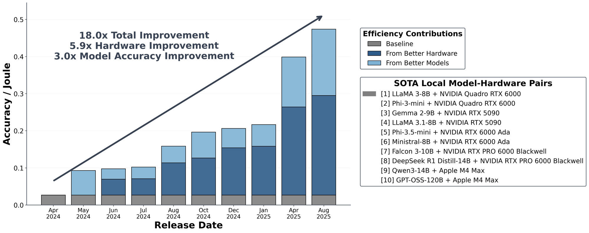
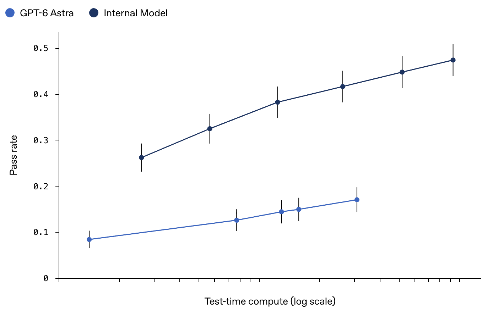
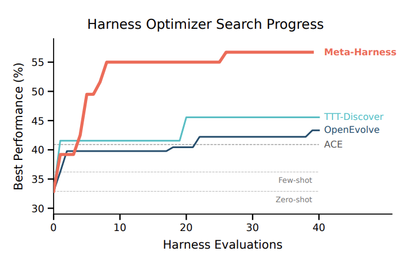
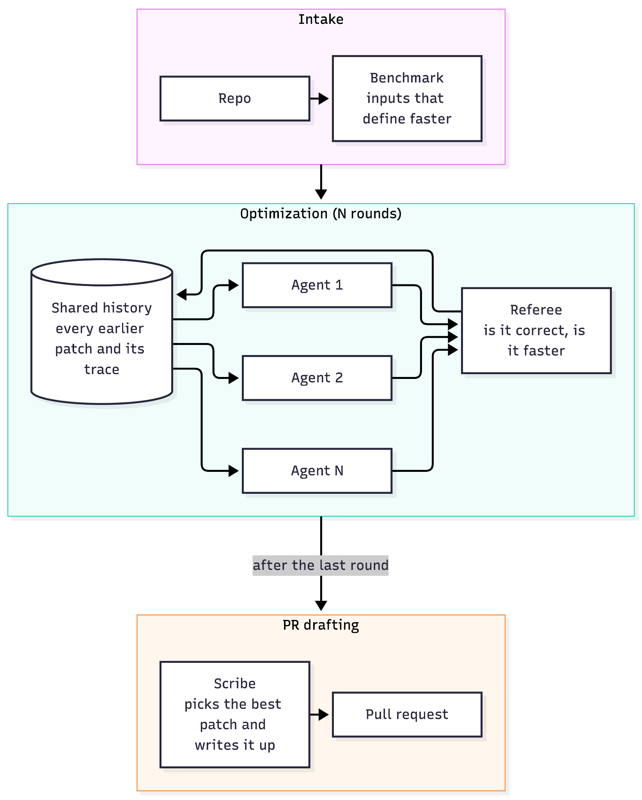
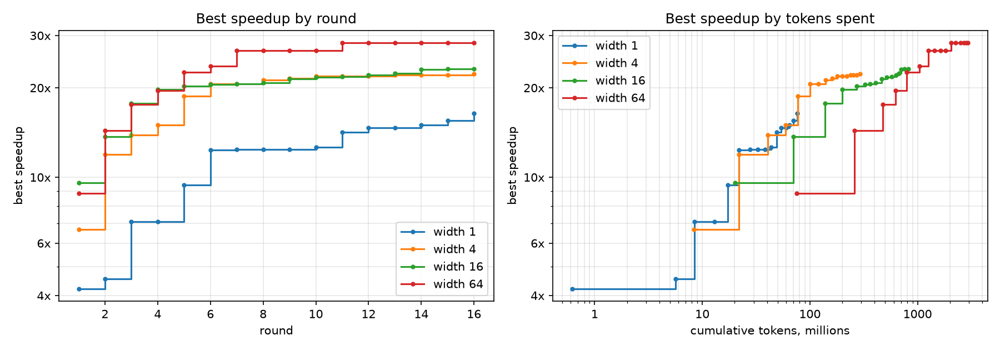
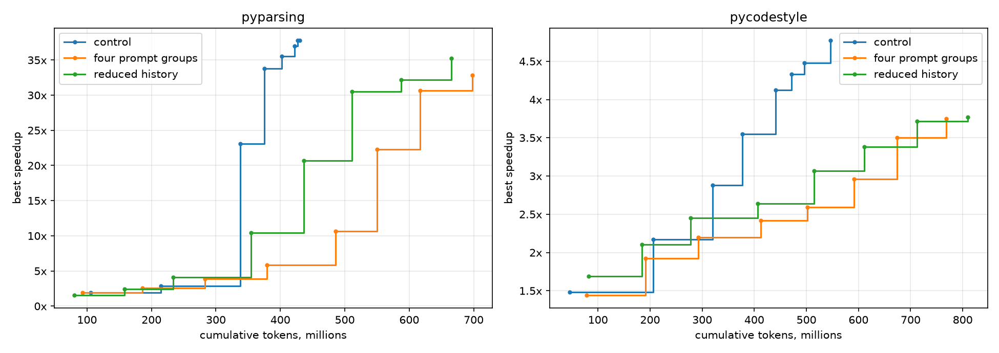
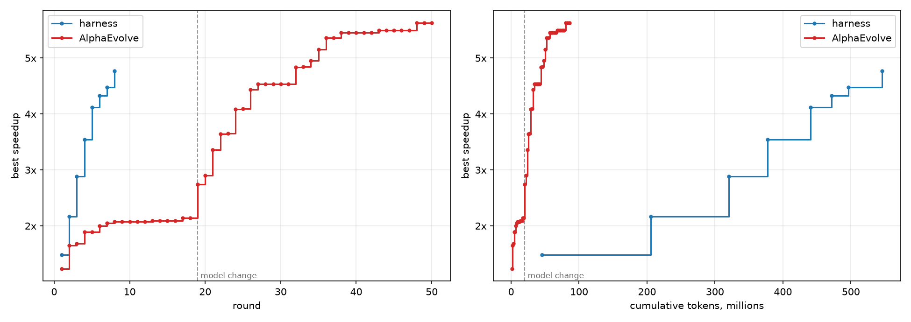

# Autoresearch Service

## 1. Introduction

I ran up to 64 coding agents in parallel to make open source Python libraries faster, and every increase in parallel compute produced faster code. This document covers what I built, what I measured, and what I learned.

- I built an autoresearch harness that turns a repository into an optimization problem and searches for faster implementations of one function.
- More agents per round found faster code at every width with clear diminishing returns past width 16.
- Coding agents converged in their approach. By the last round of the width 64 run, 63 of the 64 agents submitted the same approach.
- I tested 2 ways to reduce convergence, in the prompt and in the agent's environment.
- Against my own build of AlphaEvolve, the harness reached the same speedup 3x faster in wall clock and spent 12x the tokens to do it.

### Why now?

The cost of running language models has dropped rapidly [[1]](https://arxiv.org/abs/2511.07885). As a result, we can now pay for token heavy workloads that were previously too expensive to justify. The question is moving from how to optimize a single model call to how to maximize what many calls can do together.

There is strong evidence that spending more compute on a problem improves the outcome [[2]](http://openai.com/index/navier-stokes-solution). OpenAI's Navier Stokes result spent that compute in parallel: the group that produced it involved on the order of 10,000 agents running at once.



*Figure 1: Saad-Falcon et al., "Intelligence per Watt: Measuring Intelligence Efficiency of Local AI," arXiv:2511.07885, 2025. Accuracy per joule for the best models small enough to run on a single workstation or laptop improved 18.0x between April 2024 and August 2025.*



*Figure 2: OpenAI, [On the Navier Stokes Millennium Prize Problem](http://openai.com/index/navier-stokes-solution). Pass rate rises steadily as test time compute grows on a log scale.*

Although results like this come from frontier research, the same approach may apply to ordinary engineering work. The primary goal of this project was to test that on a CPU bound problem: making popular open source Python libraries faster while maintaining correctness. The end product of each run is a pull request that a maintainer would be willing to merge. This report covers the harness built to do this, which runs up to 64 agents in parallel against [networkx](https://github.com/networkx/networkx), [pyparsing](https://github.com/pyparsing/pyparsing) and [pycodestyle](https://github.com/pycqa/pycodestyle).

## 2. Harness Overview

The harness was inspired from [Meta-Harness](https://arxiv.org/pdf/2603.28052): a search loop built to improve other agent harnesses. In each iteration, a coding agent reads a filesystem holding every earlier candidate: its source code, its score, and the logs from evaluating it. The agent proposes a new candidate, the candidate is evaluated, and the results are written back to the filesystem for the next iteration.

I built on this approach because it was designed to spend tokens. Earlier optimizers compress what the model sees. AlphaEvolve keeps a small window of past programs and their scores, and the Meta-Harness paper estimates that it gives each evaluation 22 thousand tokens of feedback. Meta-Harness keeps all feedback accessible, approximately 10 million tokens per evaluation.



*Figure 3: Lee et al., "Meta-Harness: End-to-End Optimization of Model Harnesses," arXiv:2603.28052, 2026. On online text classification, Meta-Harness matches the next best optimizer's final accuracy after 4 evaluations and keeps improving past it.*

My harness keeps this idea of a full, shared history, but changes how the search runs. Meta-Harness uses a single agent that proposes a few candidates per iteration. My harness runs many agents in parallel each round, all reading the same history and all scored by the same evaluator.

My harness has three main stages:

1. **Intake** turns a repository into a benchmark the agents can be measured against. A model reads the repository and proposes an operation to time, such as parsing a string. The harness checks the proposal and produces a config: the operation, the inputs to run it on, and a profile of each input.

2. **Optimization** searches for patches in rounds. Each round, many agents read the same history, and each submits one patch from its own copy of the repository. A separate evaluator runs the library's tests on each patch and times it against the original code on new instances of each input. Each attempt is added to the history for the next round: the patch, the agent's trace, and the evaluator's measurement of correctness and speedup on each input.

3. **PR drafting** turns the search into a pull request. A model picks the patch a maintainer is most likely to merge, weighing speedup against lines changed. It writes the description in the style of the repository's recent pull requests and ends with a table of the measurements.

Intake and PR drafting each run once, while optimization repeats for as many rounds as the run allows. The stages fit together as shown below.



*Figure 4: My Proposed Harness*

## 3. Experiments

### 3.1 Parallelism vs Performance

The harness has two settings: width, which is the number of agents working in parallel each round, and the number of rounds. I ran it on the networkx repo at widths 1, 4, 16 and 64, for 16 rounds each, and intake chose [cluster.py lines 161 to 191](https://github.com/networkx/networkx/blob/c94928ed94899033126c9d47f797a1f698584b20/networkx/algorithms/cluster.py#L161-L191) as the target function.



*Figure 5: Best speedup found so far, plotted by round (left) and by cumulative tokens (right), for networkx at widths 1, 4, 16 and 64 over 16 rounds.*

These results support the idea from the intro that spending more compute improves the result. With the number of rounds fixed, wider runs generally reached a higher speedup: width 1 ended at 16.4x, widths 4 and 16 at 22.3x and 23.2x, and width 64 at 28.4x. With the width fixed, every run kept improving as rounds went on. Wider runs cost more per gain. Going from width 4 to width 64 uses 16 times the attempts, and the best speedup rises from 22.3x to 28.4x: a relatively marginal gain, but still a gain.

### 3.2 Convergence

The larger width runs beat lower width runs because in each round the larger width runs can take more shots on goal. Because of that they're more likely to get a faster solution. That argument only holds while the shots themselves are different. Every agent reads the same history and sees the same best patch, so their patches move towards each other as the rounds go on. In the first round of the width 64 run, every proposer agent made a unique diff. By the last round, 32 of the 64 diffs were completely identical, and 63 of the 64 diffs were the same approach.

This could be why the width 64 run set no new best in its last 5 rounds. The other explanation is that it had already found the best solution available. If it had, then converging on it is the right outcome. If it had not, the run had no way left to find out. A better solution means a different approach, and by the last round that wasn't happening.

Because of this, I believe a harness should not completely converge early, even if there's something initially promising (similar to SGD where the noise in each step is what keeps the search out of the nearest local minimum).

### 3.3 Breaking Convergence

At a high level, an agent is shaped by two things: (1) its system prompt, and (2) the environment it is placed in, in our case the filesystem holding the repository and every earlier attempt. In the current setup every agent in a round gets the same prompt and the same filesystem. To reduce the rate of convergence, one or both of these things has to change. I ran two more experiments testing one of the changes.

#### Changing the Prompt

The first change gives the agents different jobs. OpenAI used something similar on the Navier Stokes, where they prompted different groups of agents with different variants of the problem statement [[2]](http://openai.com/index/navier-stokes-solution). Here the problem is the same for every agent, so what differs is the kind of change each group is asked for. The agents are split into four equal groups. The first group keeps the original prompt. The second is told to try an approach that departs from the best patch. The third is explicitly told to combine ideas from earlier attempts. The fourth is told to reach the same speedup in a smaller diff. Every agent still reads the whole history, so the only thing that differs is what each group is asked to do with it.

#### Changing the Filesystem

The second change edits what the agents read. My guess is that the best patch is the most useful thing to the agent in history, so most of an agent's attention goes to it. If that is right, removing it should change what the agents do. Half of the agents read a history with the best patch removed, along with every attempt that overlaps it by 50% or more, so they start the round somewhere other than the current best.

Both changes are measured against the original harness. Each of the three runs is width 16 for 8 rounds, and I ran all three on the [pyparsing](https://github.com/pyparsing/pyparsing) and on the [pycodestyle](https://github.com/pycqa/pycodestyle) repos.

#### Results

Neither change beat the control.

| Run | Speedup (pyparsing) | Speedup (pycodestyle) |
|---|---|---|
| Control | 37.8x | 4.77x |
| Reduced History | 35.3x | 3.77x |
| Prompt Groups | 32.9x | 3.75x |



*Figure 6: Three Runs on Each Repository. Best speedup by round for all three runs, width 16 and 8 rounds each.*

The control also used fewer tokens. Both changes cost between 25 and 50% more tokens than the control, and both finished with smaller speedups on each repository.

#### Why the control beat out the two strategies

A record here means an attempt that beat every attempt before it.

In the run with four prompt groups, each group ran 32 attempts. The agents on the original prompt set the most, 16 records on pyparsing and 15 on pycodestyle. The agents told to combine earlier attempts set 8 and 7. The agents told to depart from the best patch set 3 and none, and the agents told to make the patch smaller set absolutely no records on either repository. So half the agents in that run never produced a leading patch.

The reduced history run is the same story. Half the agents could not see the best patch in every round after the first. That half set 3 records on pyparsing and 0 on pycodestyle. The half that saw everything set 15 and 19 records respectively.

Both experiments did what they were meant to do. In the two experiments almost every agent submitted a different patch. The control sat at the other extreme. It resubmitted a patch that had already been measured in 62 of its 128 attempts on pyparsing and in 45 of 128 on pycodestyle. So nearly half the control's agents spent a round redoing work that was already done, and the control still won. Repeats waste money, but they come with every agent working on what is already working, and within the 8 round horizon, it proved to be more optimal than spreading the agent's approaches out.

### 3.4 Harness against AlphaEvolve



**By Token Efficiency:** AlphaEvolve wins by a wide margin. It reached 5.63x for 86 million tokens. The harness spent 545.8 million and ended at 4.77x. AlphaEvolve passed the harness's final number at 44 million tokens, about a twelfth of what the harness spent.

**By Round:** the harness wins. It reached 4.77x in 8 rounds. AlphaEvolve was at 2.07x after 8 rounds, took 32 rounds to pass 4.77x, and finished at 5.63x after 50.

**By improvement per hour:** the harness wins again. The harness reached 4.77x in 6.5 hours. AlphaEvolve needed 15.9 hours to pass that and 21.2 hours to reach 5.63x. The harness spends tokens in parallel, so its extra cost lands on the bill and not on the clock.

AlphaEvolve reached our harness's result on 1/12th of the tokens. The harness got there in about 1/3rd of the wall clock time. That is the tradeoff.

Pick AlphaEvolve if tokens are the scarce thing.

Pick our harness if you have extra compute and need the result sooner.

### 3.5 Reward Hacking

While iterating on this harness I ran into many instances of reward hacking. On the networkx repo, a patch hardcoded the answers inside the graph object and read it back on later calls. Led to a false 6400x speedup. On pycodestyle, a patch did a similar thing as networkx and rebuilt the benchmark files at import time. Led to a false 3470x improvement.

None of this was deliberate cheating. The agents were told to make the number go up, and each of these achieves that goal. Whatever the evaluator measures becomes the real goal, and any difference between what it measures and what you actually want will be exploited, so in harness design it is critical to ensure that they are aligned.

## Running the harness

An agent harness that makes CPU bound Python faster and proves it. Built for the Sail
Research agent engineering project. Workers propose patches to a target repository from
inside sailboxes, a referee measures every patch against the same original commit on its
own sailbox, and every measurement is appended to a history that the next workers read.

The target is described entirely by the `[target]` section of a run's config. The
harness knows nothing about any particular repository; the first target was networkx,
and `artifacts/` is the measurement record from building against it.

### Layout

| Path | What |
|---|---|
| `src/autoresearch/` | The harness. Host code that runs on the laptop or the control box. |
| `src/autoresearch/guest/` | Standard library only programs uploaded into sailboxes. |
| `tests/` | Unit tests against fakes. No network. |
| `configs/` | One TOML file per run. |
| `phase1/` | The measurement scripts that produced `artifacts/`. Not part of the harness. |
| `artifacts/` | `repo.md`, `measurements.md` and `generality.md`, the networkx record. |

### Develop

```
uv sync
uv run pre-commit install
scripts/check.sh        # ruff format, ruff lint, mypy strict, pytest
```

`SAIL_API_KEY` is read from `.env`, which is not committed.

### Nothing left running

Every box is created with auto sleep off, so a box nobody terminates bills until
someone does. The harness terminates each one when the process holding it exits,
however it exits:

- `run` terminates its referees on every exit: the last round, `--until`, an
  exception, Ctrl+C, SIGTERM or SIGHUP. A resumed run builds new ones, and first
  terminates any a killed run left named in `boxes.json`.
- A worker terminates its own box at the end of every attempt.
- `check`, `profile`, `calibrate` and `measure` terminate their box unless `--keep`.
- A launched run is followed by `release-control`, which terminates the control
  box once no run is going on it, unless launched with `--keep-control`. `fetch`
  brings up a temporary box on the volume when the control box is gone.

No code in a process survives `kill -9`, a dead laptop or a lost control box. After
any of those:

```
uv run autoresearch reap          # every live box in the app
uv run autoresearch reap --yes    # terminate them all, including any run still going
```

### Adding a target

A target is a `[target]` section. Every fact the harness needs is in it:

```toml
[target]
name = "..."
repo = "https://github.com/org/repo"
sha = "<pinned commit>"
package = "pkg"                # import name; imported by path from the tree, never installed
alias = "p"                    # the name the package is bound to in setup and call
package_root = "."             # directory put on sys.path, relative to the repo: "src" for a src layout
hot_file = "pkg/hot.py"        # where the worker is pointed; the referee checks it ran
call = "p.compute(x)"          # the expression that is timed
pip = []                       # dependencies on top of pytest and pytest-xdist
apt = []                       # Debian packages on top of git, curl, build-essential, time, util-linux
allow = ["pkg/**"]             # what a patch may touch
deny = ["tests/**"]

[target.tests]
module = "tests/test_hot.py"   # the hot module's own tests; the worker runs these
full = "tests"                 # the whole suite; the referee runs it on every submission

[[target.inputs]]
name = "small"
setup = "x = p.make(100)"      # statements run once per launch, with the alias and ROOT bound
                               # noise_floor is absent until autoresearch calibrate has measured it
```

`setup` runs in a namespace holding the package under `alias` and `ROOT`, a `pathlib.Path`
of the tree under test, so an input can read a file from the repository. `call` is
evaluated in that namespace and timed. Its result is fingerprinted so both trees can be
shown to compute the same thing; a target whose result the generic fingerprint cannot
render can give a `fingerprint` expression over `result`.

What the harness can measure, which follow from how the referee works rather than from
any target:

1. **A pure Python hot path.** cProfile self time is attributed to `hot_file`, and the
   referee refuses to time an input on which it did not execute. A C extension never
   shows as executed.
2. **Import by path.** `package_root` on `sys.path` must make `import <package>` resolve
   inside the checkout. Nothing is installed.
3. **A single threaded call.** Every timing launch is pinned to one core, so a call that
   spreads work across threads is measured serialised and a patch that adds parallelism
   measures as no faster.
4. **A deterministic result.** Two launches of the same tree must fingerprint the same.
5. **A call between about 5ms and 80s.** Below that a calibrated floor is too loose to
   grade on; above it `repeats_per_launch` calls do not fit inside one launch timeout.
6. **Both suites pass on the base commit and finish inside the referee's timeout**, 1200
   seconds with four xdist workers for the full suite.
   The timing launches one attempt costs, summed over every input, must also fit 1200
   seconds, which bounds calibration as well; `check` estimates it from the call times.
7. **Dependencies installable by pip or apt on Debian.**

One command runs every step for a new target, from its URL to a patch and a pull
request description:

```
uv run autoresearch auto <github url> --width 4 --rounds 2                            # free: clone, draft, print the plan
uv run autoresearch auto <github url> --width 4 --rounds 2 --yes --until calibrated   # admission only
uv run autoresearch auto <github url> --width 4 --rounds 2 --yes                      # everything, or resume
```

Without `--yes` it takes the repository in, prints every box and model call the later
steps create, and spends nothing. With `--yes` it reads the stage from disk before each
step, so running it again resumes where it stopped. A failed `check` goes back to the
proposing conversation with the check's report, at most twice; each rejected config is
kept in `runs/auto/<name>/rejected/`. A step that leaves the stage unchanged, such as a
calibration that leaves an input without a floor, stops the command. `--until` takes
`config`, `admitted`, `calibrated` or `run`. The result is
`runs/scribe/<run_id>/<timestamp>/pr.md` and `patch.diff`; nothing is sent to GitHub.

The same order, one command per step, so each cost is its own decision:

```
uv run autoresearch intake <github url>                  # free: clone, judge scope, draft metadata and a brief
uv run autoresearch intake propose runs/intake/<name>    # one model conversation: call, inputs, config
uv run autoresearch check configs/<run_id>.toml          # one referee box, no model: judges the rules above
uv run autoresearch profile configs/<run_id>.toml        # one referee box, no model: the worker's documents
uv run autoresearch calibrate configs/<run_id>.toml      # one referee box, no model: the noise floors
uv run autoresearch run configs/<run_id>.toml --until 1
uv run autoresearch scribe runs/<run_id>                 # one model conversation: pick an attempt, write its PR
uv run autoresearch next configs/<run_id>.toml           # free: which step a config is at, what the next creates
```

`intake` never runs the repository's code: it reads files, and refuses a repository that
is not a Python project, has a compiled build, has no package at `.` or `src/`, or has no
tests. `intake propose` gives the model read only tools over the clone and validates its
answer without executing it; the config is written only once it parses back exactly.
Whether the proposed inputs span the regimes a patch can trade between is a judgment no
command makes; on the step by step path, read `runs/intake/<name>/brief.md` and the
proposed inputs before the go for `check`.

`check` surveys the base tree, prints every rule's verdict and refuses the target if one
fails. `profile` and `calibrate` write `docs` and each input's `noise_floor` back into
the config, and write nothing if the file changed while their box ran. `run` refuses a
config with any input that has no floor.

`scribe` filters a finished run's attempts in code, shortlists at most twelve, and has
one model conversation pick the one a maintainer would merge and write its pull request
in the style of the repository's last merged ones. The model can read the target's
source at the base commit, and is asked to teach the maintainer something about their
code that the diff does not show. The explanation comes first, then one sentence and
one table of measurements. A description stating a number with a unit that the
measurements do not contain, or with a hyphen or dash anywhere in its prose, is sent
back.
